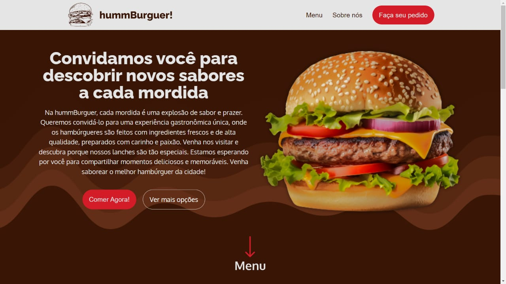
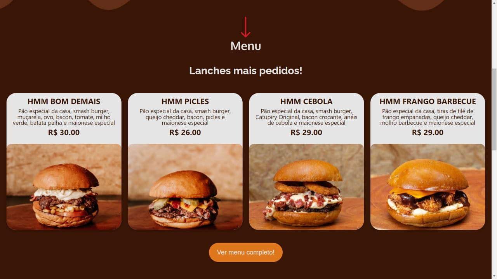
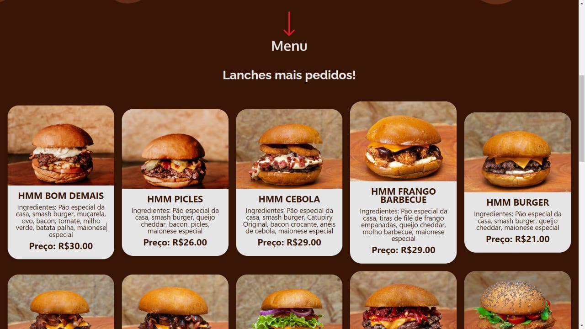
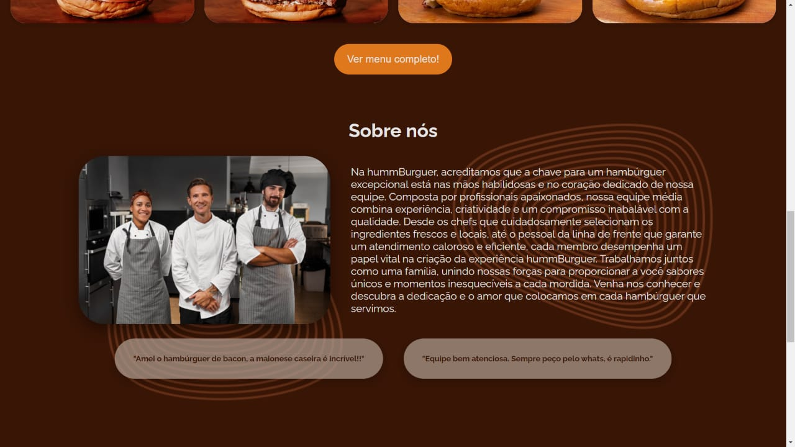
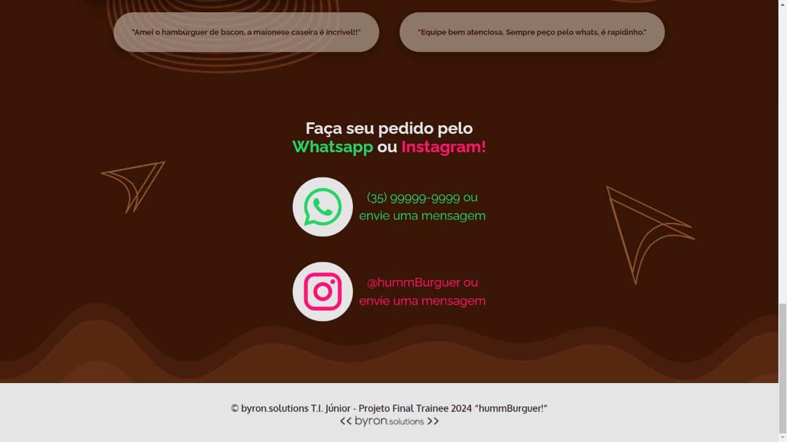

# Projeto final - Grupo3: hummBurguer!

## Na capacitação tecnológica de trainee na empresa júnior da UNIFEI, byron.solutions, nossa equipe foi desafiada a entregar um projeto final utilizando as ferramentas e ensinamentos de Git, HTML, CSS, JavaScript e consumo de API.

## Detalhamento do site

> 💭 Decidimos criar um site para uma **hamburgueria** fictícia, considerando o crescimento do ramo alimentício online. Este projeto alia a conveniência do usuário de fazer pedidos pela internet com a possibilidade da empresa expandir seus negócios digitalmente. Ademais, visando uma boa experiência do usuário, criamos uma interface intuitiva e atraente, garantindo que a navegação seja fluida e sem complicações.

> 📝 O projeto, chamado **hummBurguer!**, é uma página de cardápio de lanches que permite ao usuário navegar pelas seções "Menu", "Sobre nós" e "Faça seu pedido", conforme descrito a seguir:
>
> > - **Header:** Contém uma barra de navegação, um texto convidativo e dois botões de ação, além de uma imagem de um hambúrguer;
> > - **Menu (uso de API):** Exibe os lanches mais pedidos e, ao clicar no botão "Ver menu completo!", faz uma requisição à API que exibe mais opções de lanches. Cada card de lanche contém nome, ingredientes, preço e foto;
> > - **Sobre nós:** Explica as visões e valores da hamburgueria, com imagens e textos, além de feedbacks de clientes;
> > - **Faça seu pedido:** Seção de contato com links para o WhatsApp e Instagram da hamburgueria;
> > - **Footer:** Rodapé com informações dos desenvolvedores do site e a logo da byron.solutions.

## Imagens do site

##### Home

---

##### Menu normal

---

##### Menu com API

---

##### Sobre nós

---

##### Contato

---

##### Aprendemos muito durante esse processo e estamos motivados a continuar nos desenvolvendo.

##### Obrigada pela oportunidade de crescimento, byron.solutions!

---

###### Júlia ArenhardtJoão GuilhermePedro

